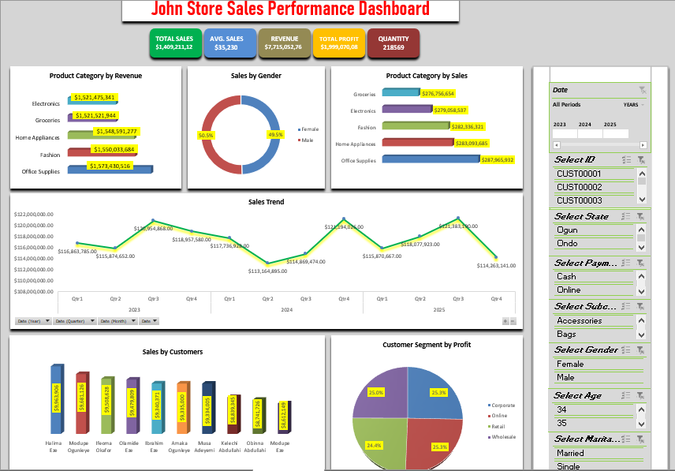

# Sales Performance Dashboard (Excel)

## Project Overview

This project presents an interactive Sales Performance Dashboard developed using Microsoft Excel. The dashboard analyzes sales transactions and customer data to provide insights into revenue, profitability, customer segments, and product performance.

## Tools Used

* Microsoft Excel
* Pivot Tables
* Power Pivot
* Slicers
* Data Modeling

## Key Performance Indicators (KPIs)

The dashboard highlights the following metrics:

* Total Sales
* Average Sales
* Revenue
* Total Profit
* Total Quantity Sold

## Visualizations

The dashboard includes the following charts:

* Product Category by Revenue
* Sales by Gender
* Product Category Sales Trends
* Sales by Customers
* Customer Segment by Profit

## Filters (Slicers)

Users can interact with the dashboard using filters such as:

* Date
* Customer ID
* State
* Gender
* Age
* Marital Status

## Dataset

The project uses two datasets:

* Sales Transaction Data
* Customer Data

These datasets are connected using Power Pivot relationships to enable advanced analysis.

## Files in this Repository

* data/

  * sales_transaction_data.xlsx
  * customer_data.xlsx

* reports/

  * Sales_Performance_Report.xlsx

* dashboard/

  * dashboard.png

## Outcome

The dashboard transforms raw sales data into an interactive analytical tool that supports data-driven decision making.

## Dashboard Preview

## Author

Damilola Oluwagbamila
